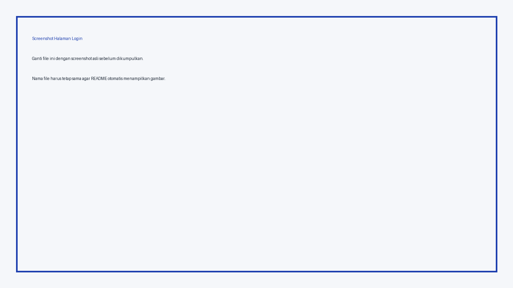
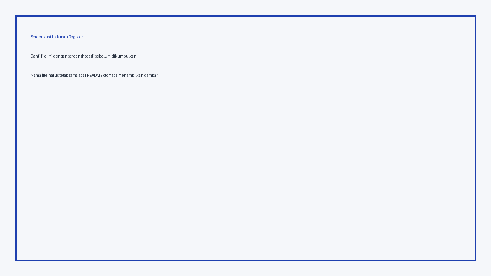
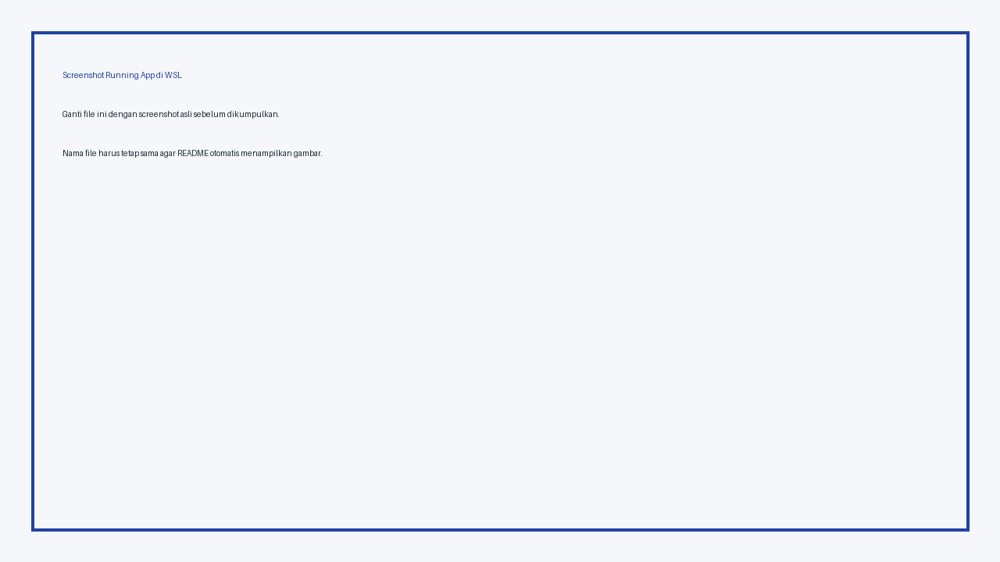

# deploypertemuan11_20220140054

Repository untuk tugas Deploy Pertemuan 11.

- Nama repo: `deploypertemuan11_20220140054`
- NIM: `20220140054`
- Framework: Spring Boot, Thymeleaf, PostgreSQL, Docker, Docker Compose
- Minimal commit: 10 commit lokal sudah disiapkan di ZIP ini

## Fitur Website

1. Halaman login
2. Halaman register
3. Halaman home
4. Form input data mahasiswa
5. Data tersimpan ke database PostgreSQL melalui Docker Compose

## Akun Default

```text
Username: admin
Password: 20220140054
```

## Cara Menjalankan di WSL / Terminal

Masuk ke folder project:

```bash
cd deploypertemuan11_20220140054
```

Jalankan aplikasi:

```bash
docker compose up -d --build
```

Cek container:

```bash
docker ps
```

Buka website:

```text
http://localhost:8000/login
```

Jika menggunakan IP WSL atau VM:

```text
http://IP-WSL:8000/login
```

## Isi `docker-compose.yml`

```yaml
version: '3.8'

services:
  db:
    image: postgres:14
    container_name: db_mahasiswa
    restart: always
    environment:
      POSTGRES_DB: praktikum_db
      POSTGRES_USER: praktikum_user
      POSTGRES_PASSWORD: 12345
    ports:
      - "5434:5432"
    volumes:
      - db_data:/var/lib/postgresql/data

  app:
    build: .
    image: deploypertemuan11_20220140054:1.0
    container_name: pertemuan11
    ports:
      - "8000:8080"
    depends_on:
      - db
    environment:
      SPRING_DATASOURCE_URL: jdbc:postgresql://db:5432/praktikum_db
      SPRING_DATASOURCE_USERNAME: praktikum_user
      SPRING_DATASOURCE_PASSWORD: 12345
    restart: on-failure

volumes:
  db_data:
```

## Cara Cek Data pada Tabel PostgreSQL

Masuk ke container database:

```bash
docker exec -it db_mahasiswa bash
```

Masuk ke database:

```bash
psql -U praktikum_user -d praktikum_db
```

Cek tabel:

```sql
\dt
SELECT * FROM users;
SELECT * FROM profile;
```

Keluar dari PostgreSQL:

```sql
\q
```

Keluar dari container:

```bash
exit
```

## Screenshot Tampilan Web

### 1. Halaman Login



### 2. Halaman Register



### 3. Halaman Home


## Screenshot WSL dan Database

### 4. Running App di WSL



### 5. Isi `docker-compose.yml`


### 6. Isi Data pada Tabel yang Terbuat


## Link Video Referensi

Code video:

```text
https://drive.google.com/file/d/1NYxr5QMD5P_295lOzR5N4yWIfb4r8-rq/view?usp=sharing
```

Video deploy di WSL:

```text
https://drive.google.com/file/d/1gevsLViIFmADGe5mclz5H86iieibIE88/view?usp=sharing
```

## Catatan Pengumpulan

Sebelum push ke GitHub, ganti file placeholder pada folder berikut dengan screenshot asli:

```text
docs/screenshots/login.png
docs/screenshots/register.png
docs/screenshots/home.png
docs/screenshots/wsl-running-app.png
docs/screenshots/docker-compose.png
docs/screenshots/table-data.png
```

Nama file jangan diubah supaya gambar otomatis tampil di README.

## Perintah Push ke GitHub

```bash
git remote add origin https://github.com/USERNAME_GITHUB/deploypertemuan11_20220140054.git
git branch -M main
git push -u origin main
```

Jika remote sudah ada:

```bash
git remote set-url origin https://github.com/USERNAME_GITHUB/deploypertemuan11_20220140054.git
git push -u origin main
```
